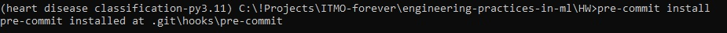
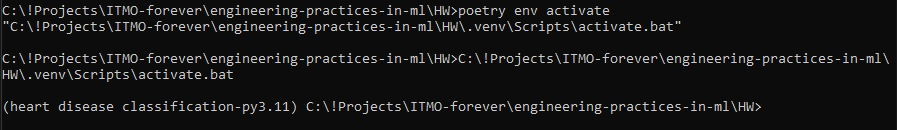
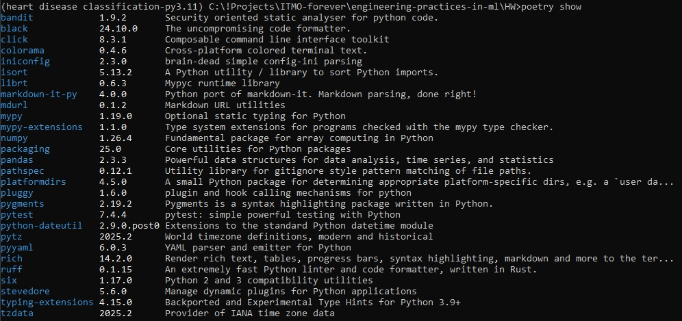

# ДЗ 1: Настройка рабочего места Data Scientist

**Проект:** Шаблон ML/DS проекта на основе Copier

**Автор:** Стародумова Е. Р.

**Дата:** 23.11.2025

---

# 1. Структура проекта

Шаблон проекта был создан с помощью инструмента **Copier**, который генерирует структуру, конфигурационные файлы и базовые настройки.

## 1.1. Структура директорий

После генерации проекта структура имеет вид:

```
project_name/
├── data/
│   ├── raw/           # Исходные данные
│   ├── processed/     # Обработанные данные
├── notebooks/         # Ноутбуки Jupyter
├── src/               # Исходный код проекта
├── tests/             # Тесты
├── .gitignore
├── .pre-commit-config.yaml
├── Dockerfile
├── pyproject.toml
├── README.md
└── ...
```

Эта структура не финальна и будет дополняться по мере необходимости.

---

# 2. Качество кода

Качество кода обеспечивается с помощью набора инструментов:

* **pre-commit** — автоматический запуск проверок при коммите
* **Black** — форматирование
* **isort** — сортировка импортов
* **Ruff** — быстрый линтер + форматтер (частично заменяет flake8 + pylint)
* **MyPy** — статический анализ типов
* **Bandit** — security-анализ

## 2.1. Конфигурация pre-commit

Файл `.pre-commit-config.yaml` включает:

* проверку окончания файла, пустые строки, YAML
* ruff (с автофиксами)
* black
* isort
* mypy
* bandit

Установка и активация:

```
pre-commit install
```




Теперь при каждом коммите будут автоматически запускаться проверки.

---

# 3. Управление зависимостями

Для управления зависимостями используется **Poetry**.
Файл `pyproject.toml` генерируется из шаблона `pyproject.toml.jinja`.

## 3.1. Poetry

Установка зависимостей:

```
poetry install
```

Создаётся виртуальное окружение и устанавливаются как runtime-, так и dev-зависимости:

* numpy, pandas
* black, isort, ruff
* mypy, bandit
* pytest

## 3.2. Виртуальное окружение

Активировать окружение:

```
poetry env activate
```



Проверка установленных зависимостей:



---

# 3.3. Dockerfile

Шаблон содержит Dockerfile для контейнеризации проекта.
Сборка контейнера:

```
docker build -t project_name .
```

Запуск:

```
docker run -it --rm project_name
```

---

# 4. Git Workflow

Репозиторий был инициализирован и настроен под ML-проект.

## 4.1. .gitignore

Файл `.gitignore` включает:

* виртуальные окружения
* кэш Python
* временные данные
* логи

## 4.2. Ветки

Принятый workflow:

* `main` — стабильная ветка
* `dev` — рабочая ветка разработки
* `feature/*` — отдельные задачи/эксперименты

---

# Вывод

В ходе работы был создан шаблон ML проекта, содержащий:

* стандартизированную структуру
* конфигурации инструментов качества кода
* автоматическую настройку окружения через Poetry
* поддержку Docker
* pre-commit hooks
* git workflow
* подробный README

---
