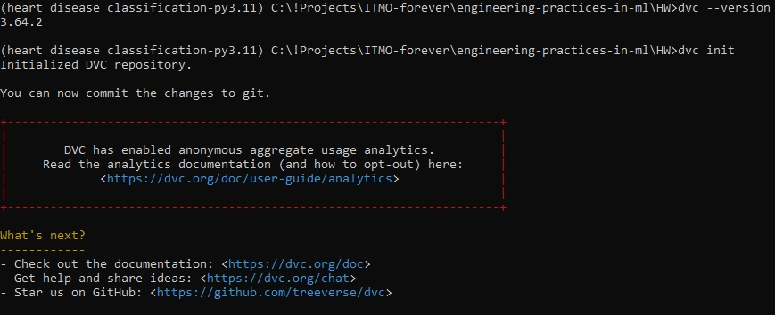
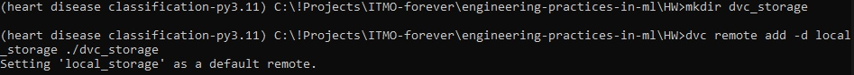
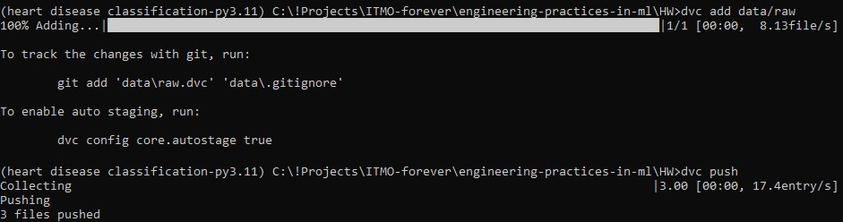
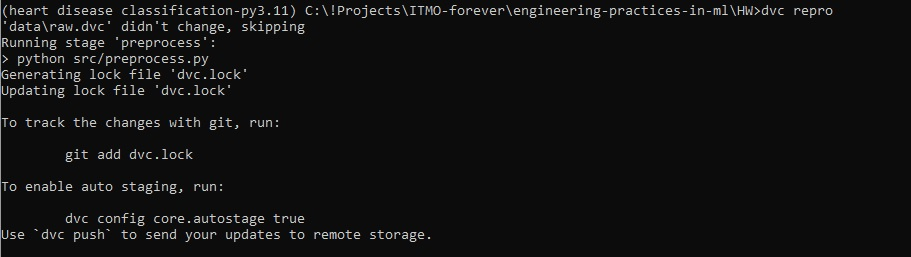
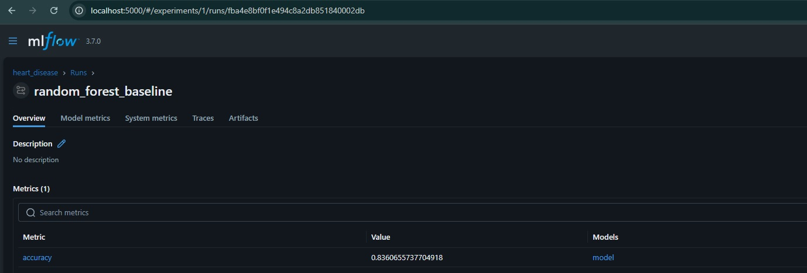
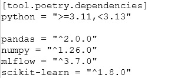

# ДЗ 2: Версионирование данных и моделей

---
## 1. Настройка выбранного инструмента для данных

Установка DVC:

```
pip install dvc
```

Проверка установки и инициализация:

```
dvc --version
dvc init
```



Настройка remote storage (локально)

```
mkdir dvc_storage
dvc remote add -d local_storage ./dvc_storage
```



Добавление данных под контроль версий
```
dvc add data/raw
dvc push
```



Автоматическое версионирование (DVC pipeline)


---
## 2. Настройка выбранного инструмента для моделей

Установка MLflow и зависимостей


Обучение модели


Запуск MLflow

```
python src/train.py
mlflow ui
```


---
## 3. Воспроизводимость

Фиксация зависимостей (`pyproject.toml`)



---
## 4. Отчет о проделанной работе

- Настроено **версионирование данных** с помощью DVC и локального remote storage. Обработанные данные отслеживаются через DVC pipeline, что обеспечивает автоматическое создание версий и воспроизводимость.
- Настроено **версионирование моделей** с помощью MLflow. Логируются параметры, метрики и артефакты модели, обеспечена возможность сравнения версий через MLflow UI.
- Обеспечена **воспроизводимость проекта**:
  - зафиксированы зависимости (`pyproject.toml`)

---
