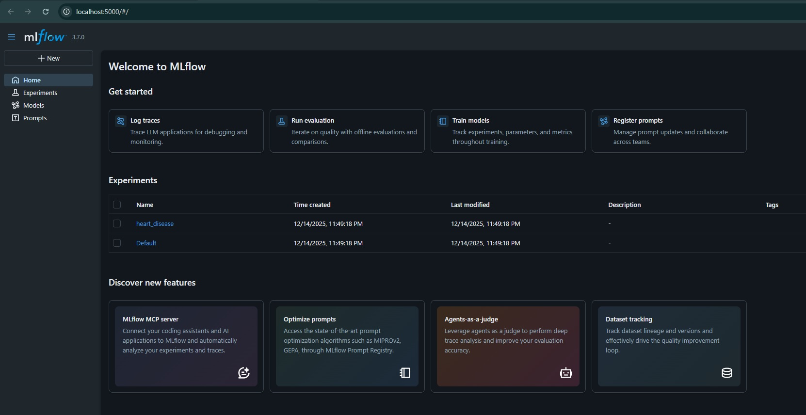
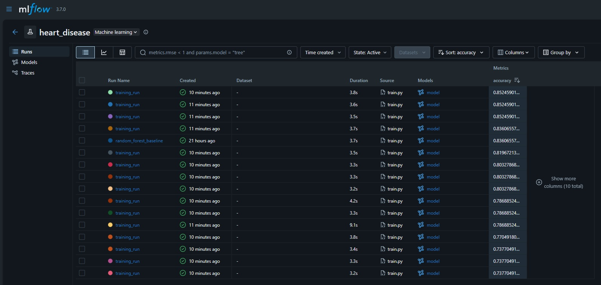
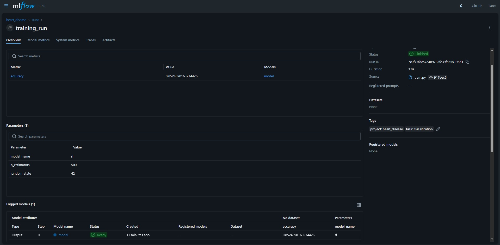

# ДЗ 3: Трекинг экспериментов

---

## 1. Настройка выбранного инструмента
В качестве инструмента для трекинга экспериментов был выбран **MLflow**, так как он:

* является open-source решением;
* поддерживает локальный режим работы;
* легко интегрируется с Python и библиотеками scikit-learn;
* предоставляет удобный веб-интерфейс для сравнения экспериментов.

Установка производилась локально с помощью Poetry:

```
poetry add mlflow
```


### Настройка базы данных/облачного хранилища

MLflow используется в локальном режиме без развертывания удалённого tracking-сервера.

Для хранения метаданных экспериментов (параметры, метрики, информация о run'ах) используется локальная база данных SQLite:

```
mlflow.set_tracking_uri("sqlite:///mlflow.db")
```

В качестве хранилища артефактов применяется файловая система. Каталог `mlruns/` автоматически создаётся MLflow и используется для сохранения:

* обученных моделей;
* логов экспериментов;
* вспомогательных файлов.

### Создание проекта и экспериментов

Для проекта был создан эксперимент с именем `heart_disease`:

```
mlflow.set_experiment("heart_disease")
```

Каждый запуск обучения модели регистрируется как отдельный **run** внутри данного эксперимента. Названия run'ов формируются динамически и содержат информацию о типе модели и используемых гиперпараметрах.

### Аутентификация и управление доступом

Так как MLflow развернут локально и используется одним пользователем, настройка аутентификации и управления доступом не требуется.

---
## 2. Проведение экспериментов

Для экспериментов используется датасет Heart Disease.

Структура данных:

* `data/raw/` — исходные данные
* `data/processed/` — предобработанные данные (`heart_processed.csv`)

Версионирование данных осуществляется с помощью DVC.

Для оценки качества моделей машинного обучения была проведена серия экспериментов с различными алгоритмами и наборами гиперпараметров. Всего выполнено **15 экспериментов**.

Используемые алгоритмы:

* RandomForestClassifier
* LogisticRegression
* GradientBoostingClassifier

Для каждого алгоритма были заданы различные значения ключевых гиперпараметров:

* **RandomForestClassifier**: `n_estimators = [50, 100, 200, 300, 500]`
* **LogisticRegression**: `C = [0.01, 0.1, 1, 10, 100]`
* **GradientBoostingClassifier**: `n_estimators = [50, 100, 200, 300, 500]`

Каждая комбинация модели и гиперпараметров запускалась как отдельный MLflow run.


### Логирование параметров, метрик и артефактов

В процессе выполнения каждого эксперимента в MLflow логируются:

* **Параметры**: тип модели, гиперпараметры, random_state;
* **Метрики**: accuracy на тестовой выборке;
* **Артефакты**: обученная модель (с использованием `mlflow.sklearn.log_model`).

Пример логирования:

```
mlflow.log_params(params)
mlflow.log_metric("accuracy", acc)
mlflow.sklearn.log_model(model, "model")
```

### Сравнение, фильтрация и поиск экспериментов

Для анализа результатов используется веб-интерфейс MLflow UI, который запускается командой:

```
mlflow ui
```



Интерфейс позволяет:

* сравнивать несколько run'ов одновременно;
* сортировать эксперименты по значению метрик;
* фильтровать эксперименты по параметрам (например, `model_name = rf`);
* находить лучший эксперимент по заданному критерию.

Данный функционал используется для выбора оптимальной модели.

---

## 3. Интеграция MLflow с кодом

### Интеграция MLflow в Python-код

MLflow интегрирован напрямую в Python-код проекта. Основная логика обучения моделей и логирования вынесена в файл `train.py`.

Для конфигурации MLflow используются следующие параметры:

* tracking URI (SQLite);
* имя эксперимента.

### Декораторы для автоматического логирования

Для автоматизации работы с MLflow был реализован декоратор `mlflow_experiment`, который оборачивает функции обучения моделей в MLflow run.

Это позволяет отделить логику обучения моделей от логики трекинга экспериментов.


### Контекстные менеджеры

Дополнительно реализован контекстный менеджер `mlflow_run`, инкапсулирующий логику создания и завершения MLflow run.

Использование контекстного менеджера повышает читаемость кода и снижает вероятность ошибок при работе с MLflow.

### Утилиты для работы с экспериментами

В модуле `mlflow_utils.py` реализованы вспомогательные функции:

* `log_common_params` — унифицированное логирование параметров эксперимента;
* общие функции и абстракции для работы с MLflow.

Данный подход упрощает поддержку кода и обеспечивает единый стиль логирования во всех экспериментах.


---

## Выводы

В рамках работы была успешно настроена система трекинга ML-экспериментов на базе MLflow. Проведена серия из 15 экспериментов с различными алгоритмами и гиперпараметрами, реализовано логирование параметров, метрик и артефактов, а также создана система сравнения экспериментов.


