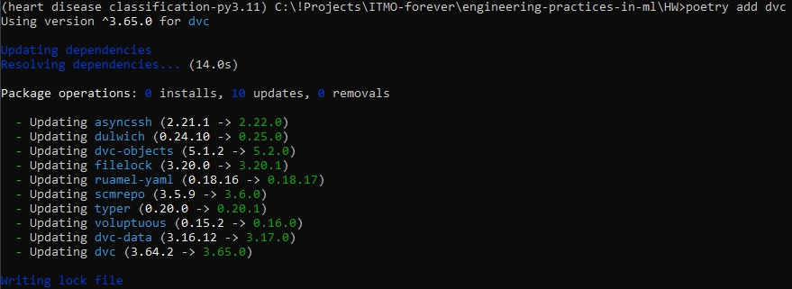
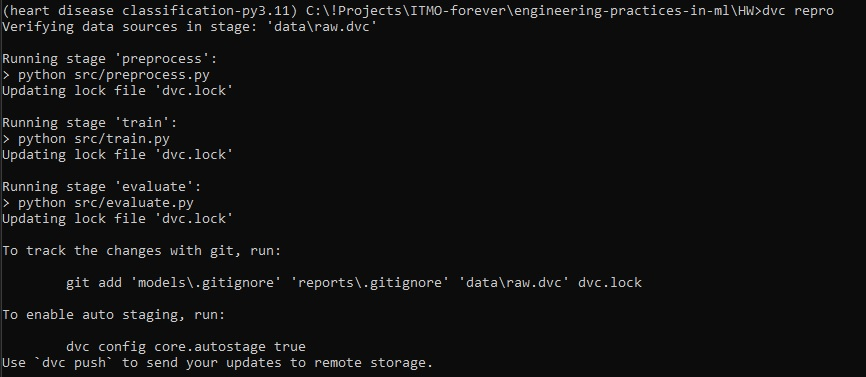
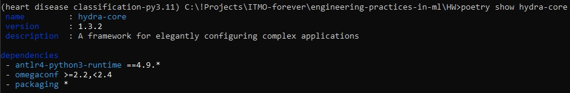
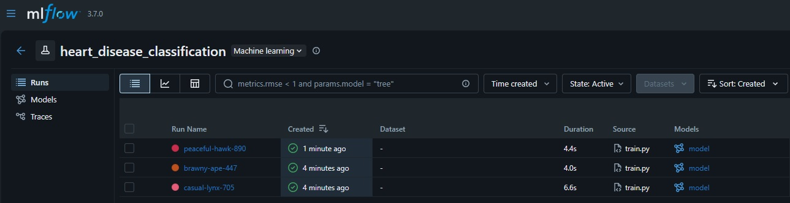
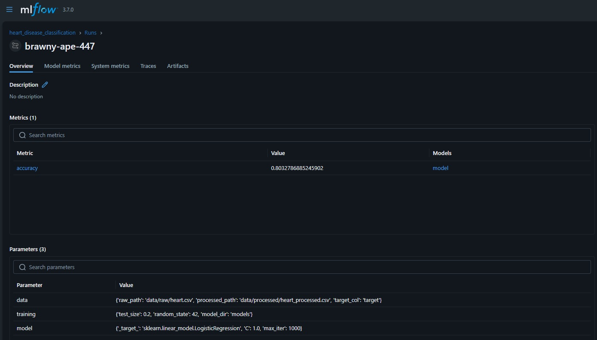
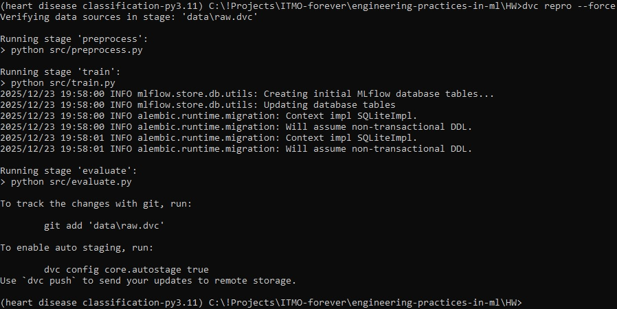
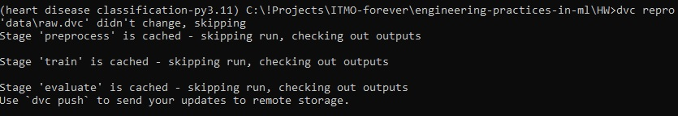
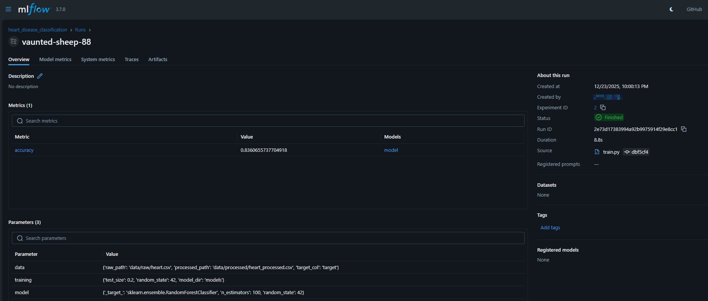
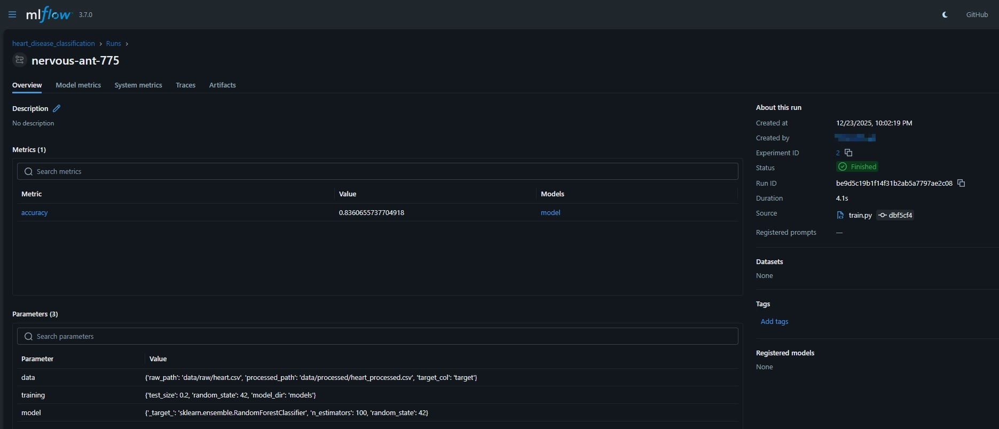

# ДЗ 4: Автоматизация ML пайплайнов

---

## 1. Настройка выбранного инструмента оркестрации
В качестве инструмента оркестрации был выбран **DVC**.

### Установка и настройка выбранного инструмента

Установка производилась с помощью Poetry:

```
poetry add dvc
```


Инициализация и настройка:
```
dvc init
mkdir dvc_storage
dvc remote add -d local_storage ./dvc_storage
```


### Создание workflow для ML пайплайна

data/raw/heart.csv ->

preprocess ->

data/processed/heart_processed.csv ->

train ->

models/model.pkl ->

evaluate ->

reports/metrics.json


### Настройка зависимостей между этапами

Добавление соответствующих stages в dvc.yaml и тестовый запуск:



В результате появляются
- models/model.pkl
- reports/metrics.json

### Реализация кэширования и параллельного выполнения



DVC автоматически определяет необходимость повторного выполнения стадий на основе хешей зависимостей и выходных артефактов, что обеспечивает кэширование и ускоряет повторные запуски пайплайна.

---

## 2. Настройка выбранного инструмента конфигураций

В качестве инструмента конфигураций выбрана Hydra.

### Настройка выбранного инструмента для управления конфигурациями

```
poetry add hydra-core
```



### Создание конфигурации для разных алгоритмов

Структура конфигураций:

```
configs/
├── config.yaml
├── data.yaml
├── training.yaml
└── model/
    ├── rf.yaml
    ├── lr.yaml
    └── gb.yaml
```

### Настройка валидации конфигураций

Настройка структурированных конфигураций и проверки типов:

```
from dataclasses import dataclass

@dataclass
class DataConfig:
    raw_path: str
    processed_path: str
    target_col: str

@dataclass
class TrainingConfig:
    test_size: float
    random_state: int
    model_dir: str

```

### Создание системы композиции конфигураций

Запуск с кастомным параметром



Композиция конфигов работает, параметры переопределяются.

---

## 3. Интеграция и тестирование

### Интеграция выбранных инструментов

Архитектура интеграции:

```
Hydra -> управляет параметрами
train.py -> обучает модель, логирует параметры и метрики
MLflow -> эксперименты, метрики, модели
DVC -> данные, модели, воспроизводимость пайплайна
```

### Создание системы мониторинга выполнения

Добавление логики Mlflow в ```train.py```, н.п.

```
MLFLOW_TRACKING_URI = "sqlite:///mlflow.db"
MLFLOW_EXPERIMENT_NAME = "heart_disease_classification"
```

Запуск экспериментов:

```
python src/train.py
python src/train.py model=lr
python src/train.py model=gb
```

Просмотр MLflow UI
```
mlflow ui
```



### Настройка уведомления о результатах



- MLflow run = один запуск = один конфиг
- логируется полная Hydra-конфигурация
- метрики + модель сохраняются

Уведомление о результатах реализовано через MLflow Tracking Server, который предоставляет информацию о статусе выполнения, параметрах и метриках экспериментов.

### Тестирование воспроизводимости

Проверка воспроизводимости:



Подтверждение воспроизводимости:



Accuracy совпадает: конфиг + данные = детерминированный результат.

---

## Выводы

В ходе выполнения задания был реализован воспроизводимый ML пайплайн с использованием современных инструментов оркестрации и управления конфигурациями.
DVC обеспечил оркестрацию этапов, кэширование и воспроизводимость данных и моделей.
Hydra позволила гибко управлять параметрами экспериментов и настраивать композицию конфигураций для различных алгоритмов.
MLflow был использован для мониторинга выполнения экспериментов, логирования параметров, метрик и артефактов моделей.

В результате получен полностью автоматизированный ML пайплайн, в котором один конфигурационный файл и зафиксированные данные гарантируют детерминированный и воспроизводимый результат обучения модели.
